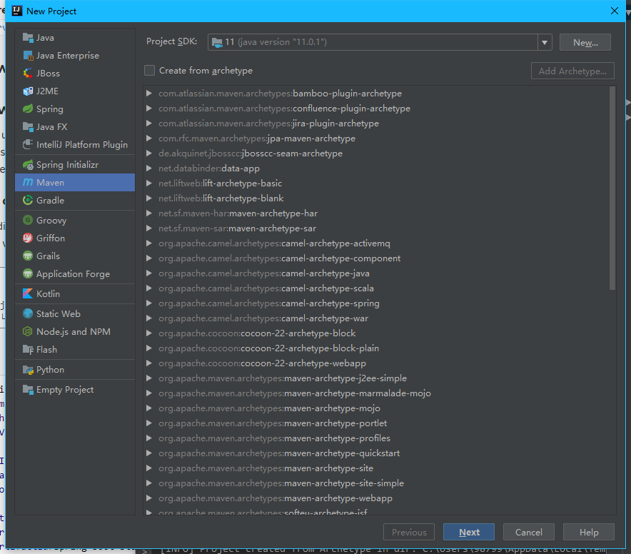
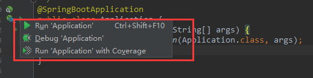
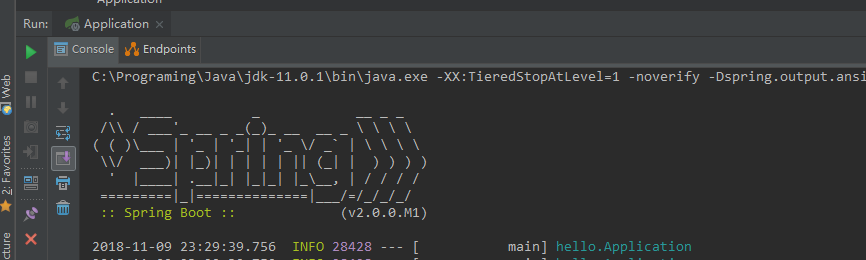
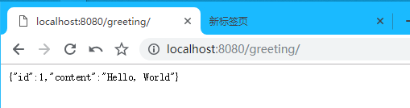
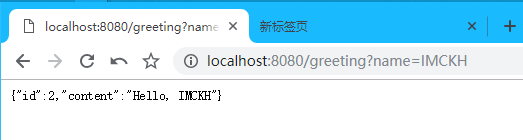
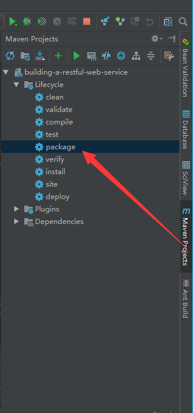
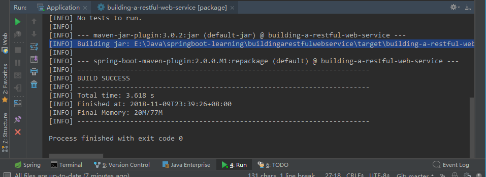

# 构建一个基于RESTful的Web服务

本指南介绍了使用Spring创建"hello world"[RESTful web service](https://spring.io/understanding/REST)的过程

## 目标

1. 构建一个将接受HTTP GET请求的service: 
    ```
    http://localhost:8080/greeting
    ```
2. 以json响应
    ```
    {"id":1,"content":"Hello, World!"}
    ```
3. 可以使用查询字符串中的可选`name`参数自定义greeting
    ```
    http://localhost:8080/greeting?name=User
    ```
4. name参数值将覆盖默认值"World"并反映在响应中
    ```
    {"id":1,"content":"Hello, User!"}
    ```

## 使用Maven构建

[使用Maven构建Java项目](https://spring.io/guides/gs/maven/)

### 使用IDEA构建

1. 使用idea创建Maven项目, 一路next
    
2. `pom.xml`
    ```xml
    <?xml version="1.0" encoding="UTF-8"?>
    <project xmlns="http://maven.apache.org/POM/4.0.0"
             xmlns:xsi="http://www.w3.org/2001/XMLSchema-instance"
             xsi:schemaLocation="http://maven.apache.org/POM/4.0.0 http://maven.apache.org/xsd/maven-4.0.0.xsd">
        <modelVersion>4.0.0</modelVersion>
    
        <groupId>com.imckh</groupId>
        <artifactId>building-a-restful-web-service</artifactId>
        <version>1.0-SNAPSHOT</version>
    
        <dependencies>
            <dependency>
                <groupId>org.springframework.boot</groupId>
                <artifactId>spring-boot-starter-web</artifactId>
            </dependency>
            <dependency>
                <groupId>org.springframework.boot</groupId>
                <artifactId>spring-boot-starter-test</artifactId>
                <scope>test</scope>
            </dependency>
            <dependency>
                <groupId>com.jayway.jsonpath</groupId>
                <artifactId>json-path</artifactId>
                <scope>test</scope>
            </dependency>
        </dependencies>
    
        <properties>
            <java.version>1.8</java.version>
        </properties>
    
    
        <build>
            <plugins>
                <plugin>
                    <groupId>org.springframework.boot</groupId>
                    <artifactId>spring-boot-maven-plugin</artifactId>
                </plugin>
            </plugins>
        </build>
    
        <repositories>
            <repository>
                <id>spring-releases</id>
                <url>https://repo.spring.io/libs-release</url>
            </repository>
        </repositories>
        <pluginRepositories>
            <pluginRepository>
                <id>spring-releases</id>
                <url>https://repo.spring.io/libs-release</url>
            </pluginRepository>
        </pluginRepositories>
    
    </project>
    ```
    - Spring Boot Maven插件提供了许多方便的特性:
        - 它收集类路径上的所有jar, 并构建一个单一的、可运行的"über-jar(超级jar)", 这使得执行和传输服务更加方便.
        - 它搜索`public static void main()`方法以标记为可运行的类
        - 它提供了一个内置的依赖项解析器(built-in dependency resolver)并设置版本号以匹配[Spring Boot依赖项](https://github.com/spring-projects/spring-boot/blob/master/spring-boot-project/spring-boot-dependencies/pom.xml)
           你可以覆盖任何您希望的版本, 但它将默认为Boot的所选版本集

## 创建一个资源表示类

通过考虑服务交互来开始这个过程.

该服务将处理`/greeting`的`GET`请求, 可选地在查询字符串中使用`name`参数. `GET`请求应返回`200 OK`响应, 其中`JSON字符串`位于表示greeting的正文中.

```json
{
    "id": 1,
    "content": "Hello, World!"
}
```

id字段是问候语的唯一标识符, 内容是问候语的文本表示.

创建资源类, 路径为`src/main/java/hello/Greeting.java`

```java
package hello;

public class Greeting {

    private final long id;
    private final String content;

    public Greeting(long id, String content) {
        this.id = id;
        this.content = content;
    }

    public long getId() {
        return id;
    }

    public String getContent() {
        return content;
    }
}
```

> 如下面的步骤所示, `Spring`使用`Jackson JSON库`将类型问候的实例自动编组为JSON.

## 创建资源控制器`controller`

在`Spring`构建`RESTful Web`服务的方法中, HTTP请求由控制器处理. 
这些组件可以通过`@RestController`注解轻松识别, 
下面的`GreetingController`通过返回`Greeting`类的实例来处理`/greeting`的`GET`请求

`src/main/java/hello/GreetingController.java`

```java
package hello;

import java.util.concurrent.atomic.AtomicLong;
import org.springframework.web.bind.annotation.RequestMapping;
import org.springframework.web.bind.annotation.RequestParam;
import org.springframework.web.bind.annotation.RestController;

@RestController
public class GreetingController {

    private static final String template = "Hello, %s!";
    private final AtomicLong counter = new AtomicLong();

    @RequestMapping("/greeting")
    public Greeting greeting(@RequestParam(value="name", defaultValue="World") String name) {
        return new Greeting(counter.incrementAndGet(),
                            String.format(template, name));
    }
}
```

**解释**

`@RequestParam`将查询字符串参数名称的值绑定到`greeting()`方法的`name`参数中. 
如果请求中不存在`name`参数, 则使用"World"的默认值.

方法体的实现基于计数器的下一个值, 创建并返回具有`id`和`content`属性的新`Greeting`对象, 并使用greeting模板格式化给定名称.

传统MVC Controller和上面的RESTful Web服务 Controller 之间的关键区别在于创建HTTP响应主体的方式.
这个RESTful Web服务Controller只是填充并返回一个Greeting对象, 而不是依靠[视图技术(View Templates)](https://spring.io/understanding/view-templates)来执行greeting数据的服务器端呈现
这个对象将被转化成json字符串的形式.

代码中使用[`@RestController`](https://docs.spring.io/spring/docs/current/javadoc-api/org/springframework/web/bind/annotation/RestController.html)注解,
可以让类中所有的方法都返回一个对象(domain object)而不是视图, 它是`@Controller`和`@ResponseBody`的缩写.

Greeting对象必须转换为JSON. 
由于Spring的HTTP消息转换器支持, 您无需手动执行此转换.
因为**Jackson 2**在`classpath`中, 所以会自动选择Spring的`MappingJackson2HttpMessageConverter`将Greeting实例转换为JSON

## 运行程序

虽然可以将此服务打包为传统的WAR文件以部署到外部应用程序服务器, 
但下面演示的更简单的方法创建了一个独立的应用程序. 
您将所有内容打包在一个可执行的JAR文件中, 由一个好的旧`Java main()`方法驱动. 
在此过程中, 使用Spring的支持将Tomcat servlet容器嵌入为HTTP运行时, 而不是部署到外部实例.

`src/main/java/hello/Application.java`

```java
package hello;

import org.springframework.boot.SpringApplication;
import org.springframework.boot.autoconfigure.SpringBootApplication;

@SpringBootApplication
public class Application {

    public static void main(String[] args) {
        SpringApplication.run(Application.class, args);
    }
}
```

`@SpringBootApplication`是一个便利注释，添加了以下所有内容:
- `@Configuration`将类标记为应用程序上下文(context)的bean定义源
- `@EnableAutoConfiguration`告诉Spring Boot根据classpath, 其他beans和各种属性开始添加beans
- 通常你会为Spring MVC应用程序添加`@EnableWebMvc`, 但Spring Boot会在classpath在看到`spring-webmvc`时自动添加它. 这会将应用程序标记为Web应用程序并激活关键行为，例如设置`DispatcherServlet`
- `@ComponentScan`告诉Spring在`hello`包下寻找其他组件, 配置和服务, 允许它找到controllers

`main()`方法使用Spring Boot的`SpringApplication.run()`方法来启动应用程序. 你是否注意到没有一行XML.
是的, 不需要`web.xml`了!!!, 此Web应用程序是`100%`纯Java, 无需处理配置任何乱七八糟的玩意儿.

### 使用IDEA配置tomcat并启动项目

这更简单了, 确保及其中安装了tomcat并配置了环境变量, 然后刚才写的application:




`2018-11-09 23:33:53.690  INFO 24052 --- [main] hello.Application : Started Acpplication in 3.521 seonds (JVM running for 3.925)`




完事.

### 构建可执行的JAR, Maven

第一种方式直接运行

`./mvnw spring-boot:run`
    
第二种方式先构建JAR包

`./mvnw clean package`

然后运行jar包

`java -jar target/building-a-restful-web-service-1.0-SNAPSHOTr`

第三种使用idea的Maven插件




## 总结

优点

- 纯JAVA的配置方式，很简单，很方便
- 使用 Spring 项目引导页面可以在几秒构建一个项目
- 方便对外输出各种形式的服务，如 REST API、WebSocket、Web、Streaming、Tasks
- 非常简洁的安全策略集成
- 支持关系数据库和非关系数据库
- 支持运行期内嵌容器，如 Tomcat、Jetty
- 强大的开发包，支持热启动
- 自动管理依赖
- 自带应用监控
- 支持各种 IED，如 IntelliJ IDEA 、NetBeans

缺点:

- 从原来的xml配置方式转换到JAVA配置方式变化有点大，可能一下子转换不过来
- 坑很多，没有一定的经验你根本就不知道springboot自动做了什么，这是件很可怕的事情


